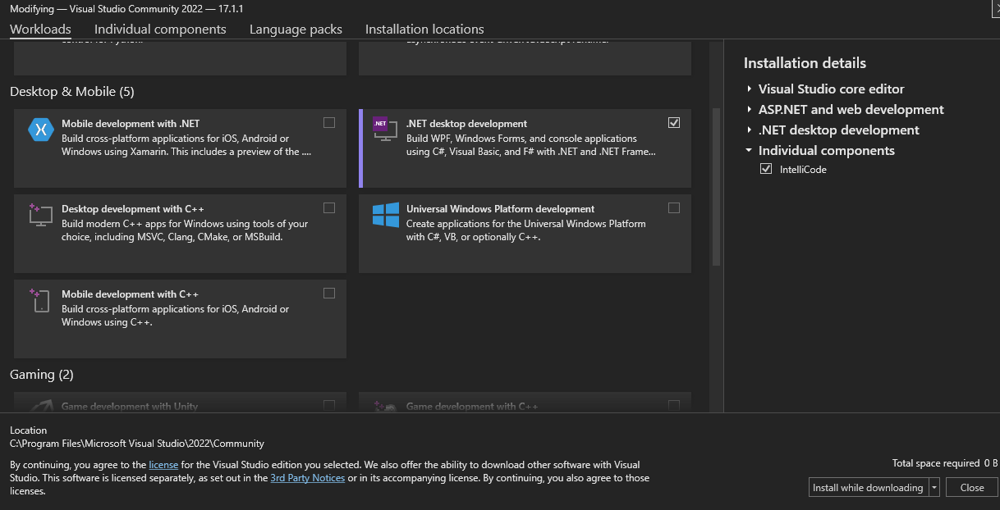

---
tags:
  - Coding
  - C++
  - Guide
---

# C++ Guide

_**Author**: Teun Engels_

---

This is a basic guide for C++.

## What is C++

C++ is a [GPL](Glossary.md#gpl) developed by [Bjarne Stroustrup](https://en.wikipedia.org/wiki/Bjarne_Stroustrup)

C++ has lots of features

- [object-oriented programming](Glossary.md#object-oriented-programming)
- [generic programming](Glossary.md#generic-programming)
- [functional programming](Glossary.md#functional-programming)
- [low-level memory manipulation](Glossary.md#low-level-memory-manipulation)

## Setup

### Installing

First of all we need a way to program C++.

We have a few options but we will show the 2 most popular ones

- VS22

- Linux (Can also be VM or WSL)

#### Windows :fontawesome-brands-windows:

The first option is Visual Studio (in this case Visual Studio Code 22).

- Here we need to go to Tools -> Get Tools & Features...

- Then a new menu will open



- Here we need to select `desktop development with C++`

- For the rest you just need to follow the installer

#### Linux :fontawesome-brands-linux:

The second option is  linux.

!!! note

    g++ is the name of the C++ compiler

For this we need to use the terminal `Press Ctrl + Alt + T`

!!! commands

    To install g++ you need to run this command

    ```
    sudo apt-get update
    sudo apt-get install gcc
    sudo apt -get install g++
    sudo apt-get install build-essential
    ```

    To check your g++ version you can run

    ```
    g++ — version
    ```

    Later in this guide we will use a debugger [GDB]() but we can install it already

    ```
    sudo apt-get update
    sudo apt-get install gdb
    ```

    To check your GDB version you can run

    ```
    gdb --version
    ```

!!! warning

    **From this point on we will use Linux for the rest of this guide.**

### Your first program

We will now make your first C++ program.

First we need to create a file called [`main.cpp`](#file-types) and we will put our code in there.

We shall ignore the code for now.

This is purely for showing you how to compile a file to an executable with [g++](#linux).

```cpp
#include <iostream>
using namespace std;

int main()
{
    cout << "Hello World!\n";
    return 0;
}
```

Now we have a file called `main.cpp` and we can compile it with `g++ main.cpp`.

```
g++ main.cpp
```

This will create a file named `a.out` (the executable's default file name). To run the program we can use `./a.out`.

!!! info

    **Note:** You can also use `g++ main.cpp -o <target_name>` to compile the program to a filed named target_name.

    ```
    g++ main.cpp -o main.exe
    ```

    This will result in a file named `main.exe` which can be run with `./main.exe`.

### File Types

#### .cpp

For C++ code we use a `.cpp` file so the [compiler]() knows we are using C++.

`main.cpp` is the source code filename typically used for the main() function of a C++ program, where the program begins execution.

```cpp

#include <iostream>
using namespace std;

int main()
{
   cout << "Hello World!\n";
   return 0;
}

```

#### .h & .hpp

If you are at all familiar with C you probably know header files.

C++ is an extend of C so C++ also uses header files. These can either have a `.h` extention or `.hpp`.

A header file includes the following three things

- Function definitions
- Data type definitions
- Macros

There are two types of header files

- **Pre-existing** header files: Files which are already available.
- **User-defined** header files: These files are defined by the user.

???+ code "Code Example"

    Here is an example of a basic header file implementation

    `main.cpp`

    ```cpp
    #include "sum.h"

    #include <iostream>
    using namespace std;

    int main()
    {
    SumOfTwo(3,4);
    return 0;
    }

    ```
    `sum.cpp`

    ```cpp
    #include "sum.h"

    int SumOfTwo(int a, int b)
    {
        return (a + b);
    }

    ```
    `sum.h`

    ```cpp
    #ifndef SUM_H
    #define SUM_H

    int SumOfTwo(int a, int b);

    #endif

    ```

### C++ Project Structure

Top-Level Directories:

```
build/
include/
src/
tests/
examples/
external/
data/
tools/
docs/
libs/
extras/
```

A lot of these Top-Level directories are not needed at the start so we shall ignore them for the beginning. But a few are important so we will take a futher look into them.

`build` is reserved for builds. So its special in that it must **not** be committed to a [Source Control System]().

`src` Source is very important here you will place your .cpp files.

!!! note

    Header File Placement

    **Separate Placement**

    ```
    <>/
    include/
        utils/
            sorting.hpp
    src/
        utils/
            sorting.cpp
    ```

    **Combined Placement**

    ```
    <>/
    src/
        utils/
            sorting.cpp
            sorting.hpp
    ```
